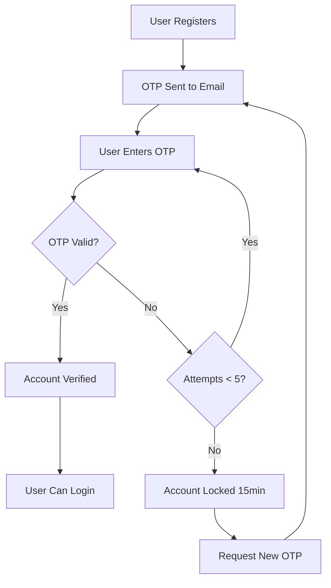

# Complete API Documentation

## Overview
This MERN authentication system provides comprehensive user registration and OTP verification with enterprise-grade security features.

## Base URL
```
Development: http://localhost:5000/api/auth
Production: https://your-domain.com/api/auth
```

## Security Features

### Rate Limiting
All endpoints are protected by rate limiting to prevent abuse and brute-force attacks:

| Endpoint | Limit | Window | Notes |
|----------|-------|--------|-------|
| `/register` | 3 requests | 1 hour | Per IP address |
| `/login` | 5 requests | 15 minutes | Per IP, only counts failures |
| `/verify-otp` | 10 requests | 15 minutes | Per IP |
| `/resend-otp` | 3 requests | 5 minutes | Per IP |
| `/forgot-password` | 5 requests | 15 minutes | Per IP |

### Account Locking
- **OTP Verification**: After 5 failed attempts, account is locked for 15 minutes
- **Automatic Reset**: Lock is cleared when requesting a new OTP
- **Attempt Tracking**: User receives countdown of remaining attempts

### Audit Logging
All authentication events are logged with:
- User ID and email
- Action type (REGISTER_SUCCESS, LOGIN_FAILED, etc.)
- IP address
- User agent
- Timestamp
- Additional details

## Authentication Flow



---

## API Endpoints

### 1. Register New User

**POST** `/api/auth/register`

Creates a new user account and sends OTP verification email.

#### Request Body
```json
{
  "username": "johndoe",
  "name": "John Doe",
  "email": "john@example.com",
  "password": "SecurePass@123"
}
```

#### Field Requirements
- **username**: 3+ characters, unique, alphanumeric
- **name**: Required, min 2 characters
- **email**: Valid email format, unique
- **password**: Min 8 characters, must include:
  - 1 uppercase letter
  - 1 lowercase letter
  - 1 number
  - 1 special character (!@#$%^&*)

#### Success Response (201)
```json
{
  "msg": "User registered. OTP sent to email.",
  "email": "john@example.com"
}
```

#### Error Responses

**400 Bad Request** - Missing or invalid fields
```json
{
  "msg": "Missing fields"
}
```

**400 Bad Request** - Duplicate email
```json
{
  "msg": "Email already registered"
}
```

**400 Bad Request** - Duplicate username
```json
{
  "msg": "Username already taken"
}
```

**429 Too Many Requests** - Rate limit exceeded
```json
{
  "msg": "Too many registration attempts. Please try again after an hour"
}
```

**500 Server Error** - Email sending failed
```json
{
  "msg": "Failed to send OTP email. Check EMAIL config.",
  "error": "Error details"
}
```

#### Security Notes
- Password is hashed using bcrypt (10 salt rounds)
- OTP is generated as 6-digit random number
- OTP is hashed before storage
- OTP expires in 10 minutes
- User is rolled back if email fails to send

---

### 2. Verify OTP

**POST** `/api/auth/verify-otp`

Verifies the OTP code sent to user's email.

#### Request Body
```json
{
  "email": "john@example.com",
  "otp": "123456"
}
```

#### Success Response (200)
```json
{
  "msg": "Email verified successfully"
}
```

#### Error Responses

**400 Bad Request** - Invalid OTP with attempts remaining
```json
{
  "msg": "Invalid OTP. 3 attempt(s) remaining before account lock.",
  "attemptsRemaining": 3
}
```

**400 Bad Request** - OTP expired
```json
{
  "msg": "OTP expired or not set. Please request a new OTP."
}
```

**400 Bad Request** - User not found
```json
{
  "msg": "No user found with this email"
}
```

**400 Bad Request** - Already verified
```json
{
  "msg": "User already verified"
}
```

**429 Too Many Requests** - Account locked
```json
{
  "msg": "Too many failed attempts. Account locked for 12 more minute(s).",
  "lockedUntil": "2025-11-30T14:30:00.000Z"
}
```

#### Security Notes
- Tracks failed attempts per user
- Locks account after 5 failed attempts for 15 minutes
- Provides countdown of remaining attempts
- Clears lock and attempts on successful verification
- Rate limited to 10 requests per 15 minutes per IP

---

### 3. Resend OTP

**POST** `/api/auth/resend-otp`

Resends a new OTP code to user's email and resets failed attempts.

#### Request Body
```json
{
  "email": "john@example.com"
}
```

#### Success Response (200)
```json
{
  "msg": "OTP resent to email"
}
```

#### Error Responses

**400 Bad Request** - User not found
```json
{
  "msg": "No user found"
}
```

**400 Bad Request** - Already verified
```json
{
  "msg": "User already verified"
}
```

**429 Too Many Requests** - Rate limit exceeded
```json
{
  "msg": "Too many OTP resend requests. Please wait 5 minutes before trying again"
}
```

#### Security Notes
- Generates new OTP (invalidates old one)
- Resets failed attempt counter to 0
- Clears any existing account lock
- Rate limited to 3 requests per 5 minutes per IP
- New OTP expires in 10 minutes

---

### 4. Login

**POST** `/api/auth/login`

Authenticates user and returns JWT token.

#### Request Body
```json
{
  "email": "john@example.com",
  "password": "SecurePass@123"
}
```

#### Success Response (200)
```json
{
  "token": "eyJhbGciOiJIUzI1NiIsInR5cCI6IkpXVCJ9...",
  "user": {
    "name": "John Doe",
    "email": "john@example.com"
  }
}
```

#### Error Responses

**400 Bad Request** - Invalid credentials
```json
{
  "msg": "Invalid credentials"
}
```

**403 Forbidden** - Email not verified
```json
{
  "msg": "Email not verified"
}
```

**429 Too Many Requests** - Rate limit exceeded
```json
{
  "msg": "Too many authentication attempts, please try again after 15 minutes"
}
```

#### Security Notes
- Returns generic "Invalid credentials" for both wrong email and wrong password
- Requires email to be verified before allowing login
- JWT token expires in 7 days
- Rate limited to 5 failed attempts per 15 minutes per IP
- Successful logins don't count toward rate limit

---

### 5. Forgot Password

**POST** `/api/auth/forgot-password`

Sends password reset link to user's email.

#### Request Body
```json
{
  "email": "john@example.com"
}
```

#### Success Response (200)
```json
{
  "msg": "If that email exists, a password reset link has been sent."
}
```

#### Error Responses

**429 Too Many Requests** - Rate limit exceeded
```json
{
  "msg": "Too many authentication attempts, please try again after 15 minutes"
}
```

**500 Server Error** - Email sending failed
```json
{
  "msg": "Failed to send reset email. Please try again later."
}
```

#### Security Notes
- Always returns same message regardless of whether email exists
- Reset token is hashed before storage
- Reset link expires in 1 hour
- Token is unique cryptographically random string
- Old reset tokens are invalidated when new one is requested

---

### 6. Reset Password

**POST** `/api/auth/reset-password`

Resets user password using token from email link.

#### Request Body
```json
{
  "email": "john@example.com",
  "token": "abc123def456ghi789",
  "newPassword": "NewSecurePass@456"
}
```

#### Success Response (200)
```json
{
  "msg": "Password reset successful. You can now login with your new password."
}
```

#### Error Responses

**400 Bad Request** - Invalid or expired token
```json
{
  "msg": "Invalid or expired reset link"
}
```

**400 Bad Request** - Token expired
```json
{
  "msg": "Reset link has expired. Please request a new one."
}
```

#### Security Notes
- Token is verified using bcrypt comparison
- New password must meet same requirements as registration
- Reset token is cleared after successful reset
- Token expires after 1 hour

---

### 7. Get User Profile (Protected)

**GET** `/api/auth/profile`

Returns current user's profile information. Requires authentication.

#### Request Headers
```
Authorization: Bearer <JWT_TOKEN>
```

#### Success Response (200)
```json
{
  "user": {
    "name": "John Doe",
    "email": "john@example.com",
    "isVerified": true,
    "createdAt": "2025-11-30T10:00:00.000Z",
    "updatedAt": "2025-11-30T10:05:00.000Z"
  }
}
```

#### Error Responses

**401 Unauthorized** - No token provided
```json
{
  "msg": "No token, authorization denied"
}
```

**401 Unauthorized** - Invalid token
```json
{
  "msg": "Token is not valid"
}
```

**404 Not Found** - User not found
```json
{
  "msg": "User not found"
}
```

---

## Data Models

### User Model
```javascript
{
  username: String,        // Unique, min 3 chars
  name: String,           // Full name
  email: String,          // Unique, lowercase
  password: String,       // Bcrypt hashed
  isVerified: Boolean,    // Default false
  otp: String,           // Hashed OTP
  otpExpiresAt: Date,    // OTP expiration
  otpAttempts: Number,   // Failed verification attempts
  otpLockedUntil: Date,  // Lock expiration
  resetPasswordToken: String,      // Hashed reset token
  resetPasswordExpiresAt: Date,    // Reset token expiration
  createdAt: Date,       // Auto-generated
  updatedAt: Date        // Auto-generated
}
```

### Audit Log Model
```javascript
{
  userId: ObjectId,      // Reference to User (optional)
  email: String,         // User email
  action: String,        // Action type (enum)
  ipAddress: String,     // Client IP
  userAgent: String,     // Browser/client info
  details: String,       // Additional information
  timestamp: Date        // When action occurred
}
```

#### Audit Log Actions
- `REGISTER_SUCCESS`
- `REGISTER_FAILED`
- `OTP_SENT`
- `OTP_VERIFY_SUCCESS`
- `OTP_VERIFY_FAILED`
- `OTP_RESEND`
- `LOGIN_SUCCESS`
- `LOGIN_FAILED`
- `LOGOUT`
- `FORGOT_PASSWORD`
- `RESET_PASSWORD_SUCCESS`
- `RESET_PASSWORD_FAILED`
- `ACCOUNT_LOCKED`
- `ACCOUNT_UNLOCKED`

---

## Error Handling

### Standard Error Response Format
```json
{
  "msg": "Human-readable error message",
  "error": "Technical error details (dev mode only)"
}
```

### HTTP Status Codes

| Code | Meaning | Usage |
|------|---------|-------|
| 200 | OK | Request successful |
| 201 | Created | Resource created (registration) |
| 400 | Bad Request | Invalid input data |
| 401 | Unauthorized | Missing or invalid token |
| 403 | Forbidden | Valid credentials but not allowed (unverified email) |
| 404 | Not Found | Resource doesn't exist |
| 429 | Too Many Requests | Rate limit exceeded |
| 500 | Server Error | Internal server error |

---

## Testing

### Running Tests
```bash
# Run all tests with coverage
npm test

# Run tests in watch mode
npm run test:watch
```

### Test Coverage
- User registration (success/failure scenarios)
- OTP verification with attempt tracking
- Account locking and unlocking
- Login authentication
- Password reset flow
- Rate limiting behavior
- Audit logging verification

---

## Environment Variables

Required environment variables in `.env`:

```env
# MongoDB
MONGODB_URI=mongodb://localhost:27017/mern-auth

# JWT
JWT_SECRET=your-super-secret-jwt-key-change-in-production

# Email (Gmail)
EMAIL_USER=your-email@gmail.com
EMAIL_PASS=your-app-password

# Client URL (for password reset links)
CLIENT_URL=http://localhost:3000

# Server
PORT=5000
NODE_ENV=development
```

---

## Best Practices

### Security
1. ✅ Always use HTTPS in production
2. ✅ Store JWT_SECRET securely (never commit to git)
3. ✅ Use Gmail App Passwords (not regular password)
4. ✅ Enable CORS only for trusted domains
5. ✅ Regularly rotate JWT secrets
6. ✅ Monitor audit logs for suspicious activity
7. ✅ Implement additional 2FA for sensitive operations

### Performance
1. ✅ Use database indexes on email and username fields
2. ✅ Cache rate limit data in Redis for scalability
3. ✅ Implement email queue for async processing
4. ✅ Use CDN for static assets
5. ✅ Enable gzip compression

### Monitoring
1. ✅ Track failed login attempts
2. ✅ Monitor rate limit violations
3. ✅ Alert on unusual account locking patterns
4. ✅ Log all security events
5. ✅ Set up uptime monitoring

---

## Common Issues

### OTP Email Not Received
1. Check spam/junk folder
2. Verify EMAIL_USER and EMAIL_PASS are correct
3. Ensure Gmail "Less secure app access" is disabled (use App Password)
4. Check email service logs for errors

### Account Locked
- Wait 15 minutes or request new OTP
- Lock clears automatically when resending OTP
- Contact support if repeatedly locked

### Token Expired
- Login again to get new token
- Tokens expire after 7 days
- Use refresh token mechanism for longer sessions

### Rate Limit Exceeded
- Wait for the specified time period
- Rate limits reset automatically
- Consider implementing user-specific rate limits

---

## Support

For issues or questions:
- GitHub Issues: [Create an issue]
- Email: support@example.com
- Documentation: README.md

---

## Changelog

### Version 2.0.0 (Current)
- ✅ Added rate limiting on all endpoints
- ✅ Implemented OTP attempt tracking and account locking
- ✅ Added comprehensive audit logging system
- ✅ Enhanced security with IP tracking
- ✅ Added modern UI components
- ✅ Created comprehensive test suite
- ✅ Improved error messages and user feedback

### Version 1.0.0
- Initial release with basic registration and OTP verification
- Login with JWT authentication
- Password reset functionality
